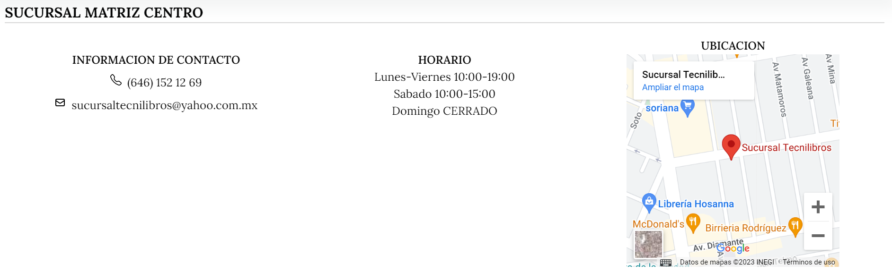

# Inicio

Es importante que en la pestaña principal tengamos una vista que nos llame la atención, por eso se decidió colocar un banner que tuviera el lema de la institución y que los identificara. Por esto mismo, se coloca una imagen que va de acuerdo al tema de la página, en este caso, son los libros.

Al mismo tiempo, es importante que los usuarios puedan ver los libros más relevantes. Por esto, se decide colocar un "carousel" con los libros más vendidos.

# Pie de Página

En esta sección se pueden acceder a otras páginas relevantes del sitio como al centro de ayuda y los terminos legales. Así como dirigirnos a la redes sociales del mismo en la parte inferior derecha.

# Página de infantil

En esta pagina como se maneja un tema enfocado a los mas chicos, priorizamos que fuese llamativo siendo colorido! primeramente podemos encontrar una cuadrícula de dos **"cards"** principales coloridas donde se busca enfocar primeramente lo que se busca inculcar a las personas las cuales se puede visualizar con un **"modal"** llamativo respectivamente al seleccionar el boton

Modal del **"card"** izquierdo

Modal del **"card"** derecho

Al mismo tiempo, se encuentra un area de secciones tambien con **"cards"** coloridos y llamativo en la cual puede darse a conocer todas las secciones infantiles que se manejan

Asi mismo en la pagina, es importante dar a conocer a los usuarios que cuentos infantiles son los mas populares en el momento. Para esto se coloco un "carousel" con los libros infantiles mas populares.

# Página de servicios

Aquí podemos encontrar una cuadrícula de **"cards"** donde podremos ver de manera sencilla los diferentes servicios que la página ofrece. Cada card cuenta con un efecto de realce que nos permitirá saber en todo momento cual estamos viendo y nos permitirá tener saber la ubicación del mouse en nuestra pagina.

# Página de Contacto

En esta página podemos encontrarnos con la información de las sucursales del establecimiento, los datos relevantes y un mapa de Google Maps que nos hace una previsualización de la ubicación, así como se puede seleccionar y dirigirnos a la aplicación de Google Maps para llegar a esta dirección.
